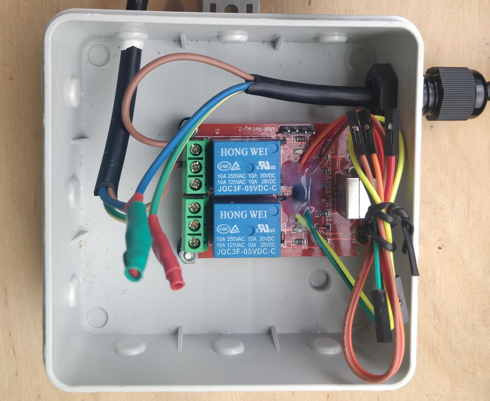

# Automatic USB mains switch

Alternative firmware for DCT Tech USB relay module, which just switches the relay on when USB bus is active. Used to build USB-controlled power strip.



More details under https://slomkowski.eu/automatic-usb-mains-switch/

Copyright 2021 Michał Słomkowski, GPL-3.0 license.

A 3D-printable enclosure with IEC C14 inlet and C13 outlet lives in [`enclosure/`](enclosure/).
It wasn't designed by me, it was sent to me by one of the readers.


## Building and flashing the AVR

Project requires *CMake* as well as *avr-gcc* installed. If you don't want to use CMake, you may adapt stock *Makefile* from V-USB library.

```bash
mkdir -p build && cd build
cmake ..
make
```

Flash with *avrdude*:

```bash
avrdude -c usbasp -p t45 -U flash:w:automatic-usb-mains-switch.hex
```

